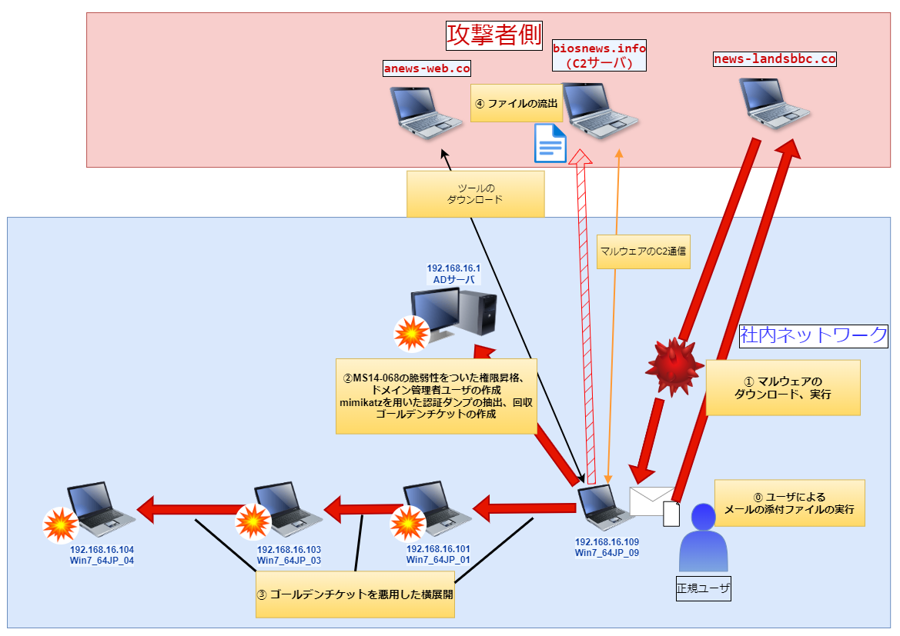

# 1 インシデントの概要
## (1) インシデントの受付
Win7_64JP_01を使⽤しているユーザからのウイルスの検知の報告

## (2) インシデントの調査結果

### ◇ 概要
メールの添付ファイルの実行によって、マルウェアがダウンロードされた。マルウェアによる、ADサーバを侵害後、社内ネットワークの端末に横展開した。最終的に、情報を外部ネットワーク上のサーバに、送信した。

### ◇ 影響範囲
社内ネットワークドメイン(exsample.co.jp) ⇒　社内ネットワークの全端末

### ◇ 侵害が確認された端末と侵害開始時刻
| 端末 | 侵害開始時刻 |
|-----|--------------| 
| Win7_64JP_09 |  15:16:53 |
| ADサーバ      |  15:26:37 |
| Win7_64JP_01 | 15:53:00  |
| Win7_64JP_01 |  16:46:36 |

### ◇ 流出したファイル
* 侵害された端末の各ユーザのドキュメントファイル(エクセル、パワーポイント、テキスト、ドキュメント等)

### ◇ 利用された脆弱性
#### MS14-068
* keroberos認証の脆弱性
* ドメインユーザによるドメイン管理者への権限昇格を可能とする
* `15:26:37` にこの脆弱性を用いてドメイン管理者に権限昇格されました。
https://learn.microsoft.com/en-us/security-updates/SecurityBulletins/2014/ms14-068

### ◇ 確認された悪意のあるツール
* mimikatz(認証情報のダンプ、ゴールデンチケット・シルバーチケットの作成、Pass the Ticketの利用)
* MS14-068脆弱性を用いた攻撃用のツール

