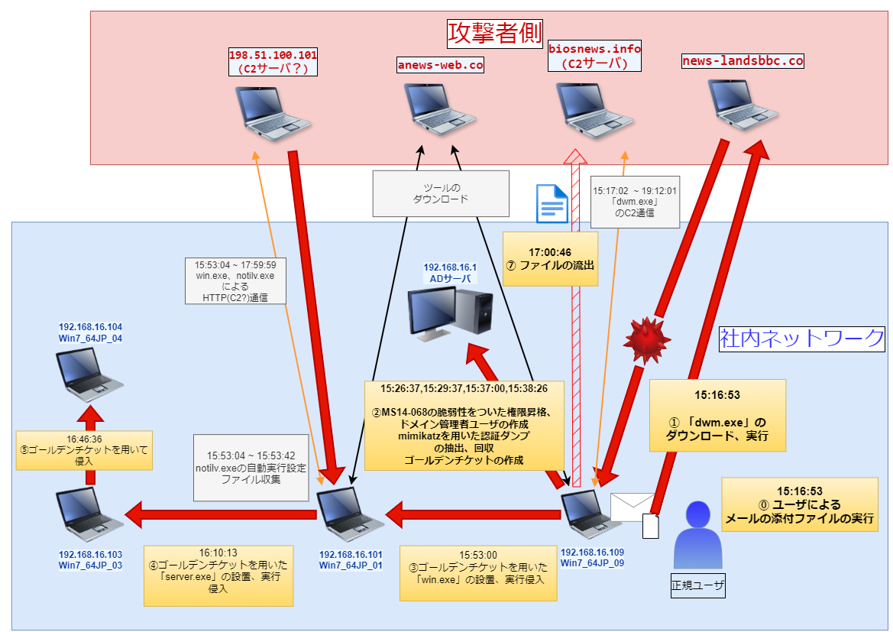

# 1 インシデントの概要
## (1) インシデントの受付
Win7_64JP_01を使⽤しているユーザからのウイルスの検知の報告

## (2) インシデントの調査結果
### ◇ インシデントの発生日時
2019/11/07

### ◇ サイバー要図

### ◇ 概要
メールの添付ファイルの実行によって、マルウェアがダウンロードされた。マルウェアによる、ADサーバを侵害後、社内ネットワークの端末に横展開した。最終的に、情報を外部ネットワーク上のサーバに、送信した。

### ◇ 影響範囲
社内ネットワークドメイン(exsample.co.jp) ⇒　**社内ネットワークの全端末**
### ◇ 侵害が確認された端末と侵害開始時刻
| 端末 | 侵害開始時刻 |
|-----|--------------| 
| Win7_64JP_09 | 2019/11/07 15:16:53 |
| **ADサーバ**      |  15:26:37 |
| Win7_64JP_01 |  15:53:00  |
| Win7_64JP_03 |  16:10:13 | 
| Win7_64JP_04 |  16:46:36 |

### ◇ 流出したファイル
* 侵害された端末の**各ユーザの文書ファイル**(エクセル、パワーポイント、テキスト、ドキュメント等)

### ◇ 流出先
biosnews.infoドメイン

### ◇ 利用された脆弱性
#### MS14-068
* keroberos認証の脆弱性
* **ドメインユーザによるドメイン管理者への権限昇格を可能とする**
* `15:26:37` に**この脆弱性を用いてドメイン管理者に権限昇格**されました。
* 詳細情報：https://learn.microsoft.com/en-us/security-updates/SecurityBulletins/2014/ms14-068

### ◇ 確認された悪意のあるツール
* mimikatz(認証情報のダンプ、ゴールデンチケット・シルバーチケットの作成、Pass the Ticketの利用)
* MS14-068脆弱性を用いた攻撃用のツール

# 2 必要な行動
## (1) 報告について
* サイバー攻撃の情報に関する開示の有無の決定
* JPCERTへの報告、協力依頼
* 関係部署等への連絡
* 端末利用者への連絡

## (2) 各端末への求められる対応
1. 侵害された端末のログ情報などの回収、証拠保全
2. ADサーバ以外の侵害に利用された端末の隔離
3. 侵害に利用された悪性ファイルの削除、作成された不審ユーザの削除、自動実行等の不審な設定の削除
4. ADサーバ以外の侵害に利用された端末のバックアップデータの作成
5. 侵害に利用された端末のリカバリー機能による端末リセット
6. ADのこれまでに作成されたチケットの無効化(ゴールデンチケット、シルバーチケット攻撃に対する対応)
7. ADサーバのアップデート(MS14-068脆弱性に対する対応)  
参考サイトhttps://learn.microsoft.com/en-us/security-updates/SecurityBulletins/2014/ms14-068
### プラスアルファ
* 管理者共有権限の悪用があったので、管理者共有の権限・機能の見直し。
* 制限サービスや各ユーザに対する権限等の見直しが必要、必要最小限の権限を与えるように見直してください
* FWの設定の変更(プロキシサーバを介したインターネットの接続だけでなく、個々の一般ユーザの端末から直接通信できるようになっているため)

## (3) 事後の調査
### ⓪ 本インシデントで利用されたマルウェアの解析
レジストリへの操作や具体的な動きを調べ、事後の根絶、復旧、問題管理に役立てる。
### ① 情報漏洩の内容の調査
侵害を受けた端末で保管管理されていた、社内文書、個人情報等の特定

### ② 漏洩された情報の公開の有無の調査・追跡
インターネット上、もしくは、ダークウェブ上に漏洩された情報等が公開されていないか調査・追跡をする

### ③ 攻撃グループの特定
* 使用された攻撃手法、利用したドメインを解析し、攻撃グループを特定する
* 攻撃グループによる弊社に対する声明がないか調べる

# 3 インシデントの詳細

## (1) インシデントの詳細な流れ(タイムライン)
### ⓪、① インシデントの初期感染、C2通信
#### ◇ 日時
2019/11/07 15:16:53  
#### ◇ 事象
Win7_64JP_09の利用ユーザがメールのドキュメントに偽装された添付ファイル「`Interview.doc.lnk`」をクリックしたところ、マルウェア「`dwm.exe`」のダウンロード、実行がされた。

#### ◇ dwm.exeのC2通信
**biosnews.info**ドメインと`15:17:02 ~ 19:12:01`の間、HTTPによるC2通信が行われていた

### ② ADサーバへの攻撃(ツールのダウンロードと使用)
#### ◇ 日時
##### ツールダウンロード
* mz.exe(mimikatz)：2019/11/07 15:22:51
* rar.exe,ms14068.rar : 15:25:43
##### MS14-068の脆弱性を利用した権限昇格
15:26:37
##### ドメイン管理者ユーザの作成
15:29:37
##### ADサーバに対する認証ダンプの抽出、回収
* 認証ダンプの抽出：15:37:00
* 認証ダンプの回収：15:37:59
##### ゴールデンチケットの作成
15:38:26
##### ◇ 事象
1. `dwm.exe`は、ADの構成及びユーザの権限の調査後、`anews-web.co`より、mz.exe(mimikatz)がダウンロードし、  
mimikatzを用いて**Win7_64JP_09**本体に含まれるログオン認証情報を盗んだ。
2. `anews-web.co`より、「rar.exe」及び「`ms14068.rar`」(MS14-068を悪用するツールをまとめたもの)をダウンロードし、  
ms14068.rarを展開、「`ms14-068.exe`」を実行し、ドメイン管理者へ権限昇格を行い、maebashi.gunmaのTGTチケットを取り出し回収した。
3. ドメイン管理者の権限を利用して、「`machida.kanagawa`」ユーザを作成し、ドメイン管理者グループに入れた。
4. DCの管理者共有の利用できるかの確認と、DCへの管理共有を用いた`mz.exe`の設置と認証情報ダンプ(LSAダンプ)の抽出を「b.bat」でタスクスケジュールによって行い、回収した。
5. DCで取得した資格情報で`sysg.admin`ユーザ権限のゴールデンチケットを作成した。

### ③ Win7_64JP_01への横展開
#### ◇ 日時
15:53:00
#### ◇ 事象
1. **Win7_64JP_09**内の文書ファイルの収集後、「`machida.kanagawa`」ユーザを削除した。
2. ネットワークの偵察後、Win7_64JP_01へ管理共有を用いて「`win.exe`」を配置し、「`q.bat`」でタスクスケジュールによって実行し、横展開した。

### ④ Win7_64JP_03への横展開(Win7_64JP_01の偵察と展開)
#### ◇ 日時
16:10:13
#### ◇ win.exeのC2?通信
* 15:53:04 ~ 17:59:59に「`win.exe`」の通信がされていた。
* これより前から、`notilv.exe`によって通信されていたのでC2であるかは、確定できない

#### ◇ 事象
1. 「`win.exe`」によって「`notilv.exe`」がレジストリの設定により実行設定された。
2. 文書情報の収集を行ったのち、`anews-web.co`より「`server.exe`」と`mz.exe`をダウンロードした。
3. `anews-web.co`より`mz.exe`をダウンロードし、mz.exeを用いてゴールデンチケットを作成した。
4. Win7_64JP_03の管理者共有で「`server.exe`」を配置しようとしたところ失敗した。
6. ゴールデンチケットを`mz.exe`で適用して、Win7_64JP_03の管理者共有で`server.exe`を配置し、`z.bat`でタスクスケジューラを用いて実行した。

###　⑤ Win7_64JP_04への横展開
#### ◇ 日時
16:46:36
#### ◇ 事象
ADサーバのログより、ドメイン管理者ユーザ「systemg.admin」のTGTのkeroberosの要求の成功ログが確認された。

### ⑥ ファイルの流出(文書ファイルの回収)
#### ◇ 日時
17:00:46
#### ◇ 事象
* Win7_64JP_09上で各端末の文書ファイルを「`rar.exe`」を用いてアーカイブにした後、「`biosnews.info`」に送信された。

### (2) 証拠
[証拠ファイル](ctf_memo.md)
